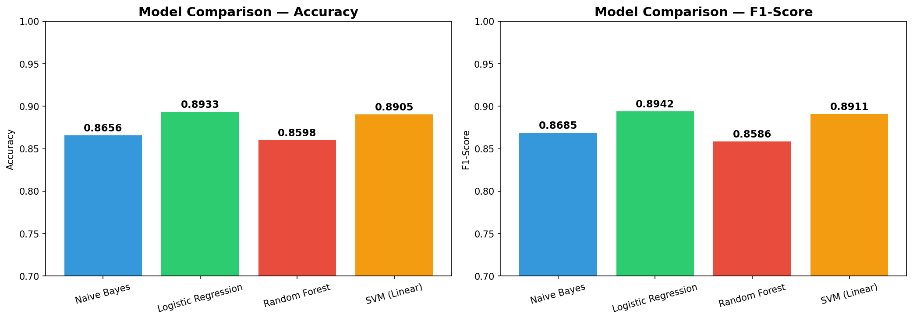
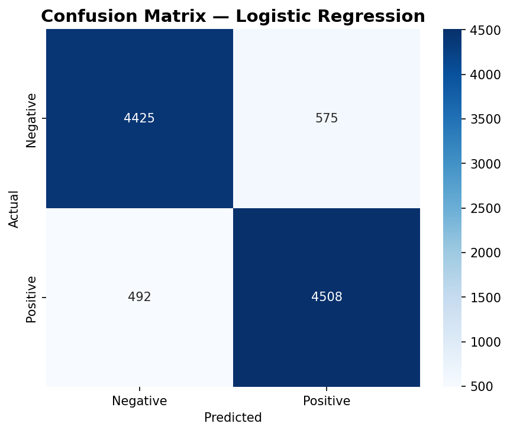
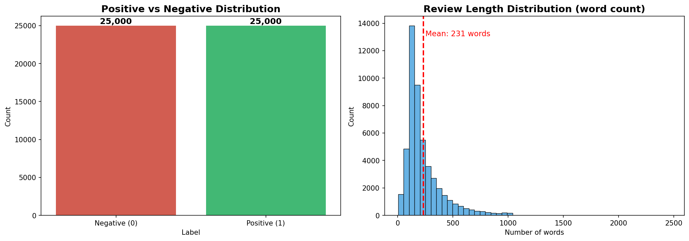

# IMDB Sentiment Analysis

An end-to-end NLP pipeline that classifies movie reviews as **Positive** or **Negative** using traditional Machine Learning techniques.


---

## Results

Trained and compared **4 ML models** on 50,000 IMDB movie reviews:

| Model | Accuracy | F1-Score |
|-------|----------|----------|
| Naive Bayes | 86.56% | 0.8685 |
| **Logistic Regression** | **89.33%** | **0.8942** |
| Random Forest | 85.98% | 0.8586 |
| SVM (Linear) | 89.05% | 0.8911 |

> **Best Model:** Logistic Regression — **89.33% accuracy**, **0.8942 F1-Score**

### Model Comparison


### Confusion Matrix (Best Model)


---

## Pipeline Overview

```
Raw Text → Preprocessing → TF-IDF → Model Training → Prediction
```

### Step-by-step:
1. **Data Collection** — IMDB Dataset (50,000 reviews, balanced 50/50)
2. **EDA** — Analyzed label distribution, review lengths, word frequency
3. **Text Preprocessing** — HTML removal, lowercasing, special char removal, stopword removal, Porter Stemming
4. **Feature Extraction** — TF-IDF Vectorizer (10,000 features, unigrams + bigrams)
5. **Model Training** — Compared Naive Bayes, Logistic Regression, Random Forest, SVM
6. **Deployment** — Interactive web demo with Streamlit

### EDA Overview


---

## Quick Start

### 1. Clone & Install
```bash
git clone https://github.com/tanhp2526/sentiment-analysis.git
cd sentiment-analysis
pip install -r requirements.txt
```

### 2. Run the full pipeline
```bash
# Step 1: Download data & EDA
python src/step1_download_eda.py

# Step 2: Preprocess text
python src/step2_preprocess.py

# Step 3: Train models
python src/step3_train.py

# Step 4: Predict new reviews (interactive)
python src/step4_predict.py
```

### 3. Run Web Demo
```bash
streamlit run app.py
```
Then open `http://localhost:8501` in your browser.

---

## 📁 Project Structure

```
sentiment-analysis/
├── app.py                      # Streamlit web demo
├── requirements.txt            # Dependencies
├── data/
│   ├── raw/                    # Original IMDB dataset + train/test split
│   └── processed/              # Cleaned text data
├── models/
│   ├── best_model.pkl          # Trained Logistic Regression model
│   └── tfidf_vectorizer.pkl    # TF-IDF vocabulary (10K features)
├── results/
│   ├── 01_eda_overview.png     # EDA visualization
│   ├── 02_model_comparison.png # Model comparison chart
│   └── 03_confusion_matrix.png # Confusion matrix
└── src/
    ├── step1_download_eda.py   # Data loading & exploration
    ├── step2_preprocess.py     # Text preprocessing pipeline
    ├── step3_train.py          # TF-IDF + model training
    └── step4_predict.py        # Interactive prediction
```

---

## 🛠 Tech Stack

| Category | Tools |
|----------|-------|
| **Language** | Python 3.13 |
| **ML** | Scikit-learn (TF-IDF, Logistic Regression, Naive Bayes, SVM, Random Forest) |
| **NLP** | NLTK (stopwords, Porter Stemmer) |
| **Data** | Pandas, NumPy |
| **Visualization** | Matplotlib, Seaborn |
| **Deployment** | Streamlit |

---

## What I Learned

- **Text preprocessing** is crucial — removing HTML, stopwords, and stemming significantly improved model performance
- **TF-IDF with bigrams** (ngram_range=(1,2)) captures important phrases like "not good" that unigrams miss
- **Logistic Regression** outperformed Random Forest on high-dimensional text data, proving simpler models can be powerful
- **The full ML pipeline**: from raw data → EDA → preprocessing → feature extraction → training → evaluation → deployment

---

## 📄 License

This project is licensed under the MIT License.
